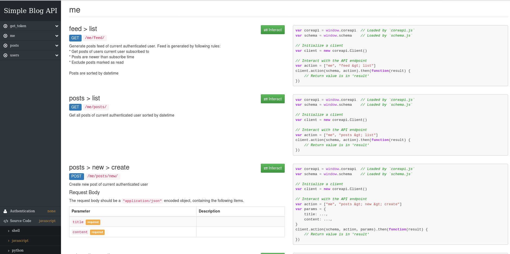

## API documentation
This is a test REST API of simple blog. It's not a real project, so it has no any frontend, except default django rest_framework.documentation. This documentation is available on home path `/` and looks like this:



## Abilities
* Users: create user, list users, get concrete user
* Posts: creare post of authenticated user, get all posts, get concrete post, get concrete user posts, get authenticated user posts
* Subscribe / unsubscribe authenticated user to other users
* Mark posts as read by authenticated user
* Generate posts feed of authenticated user

## Authentication
API provides two types of authentication:

* Authentication by cookie/session: `/login` and `/logout` using browser.
* Authentication by token: Follow `/get_token` route to get authentication token and use it in http header: `Authorization: Token <token>`

## Data exchange format
* All data exchange implemented in JSON format
* For POST requests the request body should be a "application/json" encoded object
* All list data is rendered in pages of 10 elements


## API URLs, short description
**Users**
`/users/new/` (POST) - create new user
`/users/` (GET) - get users list, sorted by posts count (max posts count first)
`/users/<id>/` (GET) - get concrete user info
`/users/<id>/posts/` (GET) - get concrete user posts sorted by datetime

**Auth**
`/get_token/` (POST) - get auth token by username and password

**Posts**
`/posts/` (GET) - get all posts in blog sorted by datetime (newer first)
`/posts/<id>/` (GET) - get concrete post data 
`/posts/<id>/mark_as_read/` (POST) - mark post as read by current authenticated user. **Needs authentication**

**Authenticated user actions**
`/me/posts/new/` (POST) - create new post of current authenticated user. **Needs authentication**
`/me/posts/`(GET) - get all posts of current authenticated user sorted by datetime (newer first). **Needs authentication**
`/me/subscribes/new/`(POST) - subscribe current authenticated user to some other user. **Needs authentication**
`/me/subscribes/`(POST) - Get all subscribes of current authenticated user. **Needs authentication**
`/me/subscribes/<user_to_id>/` (GET, DELETE) - view or delete subscribe of current authenticated user. **Needs authentication**
`/me/feed/` (GET) - Generate posts feed of current authenticated user. **Needs authentication**

Feed is generated by following rules:

* Return posts of users current user subscribed to
* Return posts whitch are newer than subscribe time
* Exclude posts marked as read by current user
* Posts are sorted by datetime (newer first)

**Docs**
`/` - get interactive panel with auto-generated docs and ability to try API actions in browser.

## API URLs, detailed description
----
### /users/new/
Register new user

**Methods**: POST

**Input JSON data:**
```
  "username" - string, required. 150 characters or fewer. Letters, digits and @/./+/-/_ only.
  "password" - string, required.
```
**Output JSON data**:
```
  "id" - int, created user id
  "username": string, created user name
  "posts_count": int, created user posts count, always 0
```

**Return code if success**:  201 Created

**Return code if failed**:  400 Bad Request

**Example of success request**:
```
$ curl -X POST -H 'Content-type: application/json' --data '{"username": "user8", "password": "some_passwd"}' 'http://127.0.0.1:8000/users/new/' 2>/dev/null | jq .
{
  "id": 9,
  "username": "user8",
  "posts_count": 0
}
```

**Example of failed request**:
```
$ curl -v -X POST -H 'Content-type: application/json' --data '{"username": "user8~~", "password": "some_passwd"}' 'http://127.0.0.1:8000/users/new/' 2>/dev/null | jq .
{
  "username": [
    "Enter a valid username. This value may contain only letters, numbers, and @/./+/-/_ characters."
  ]
}

```
----

etc... TODO: describe all urls


