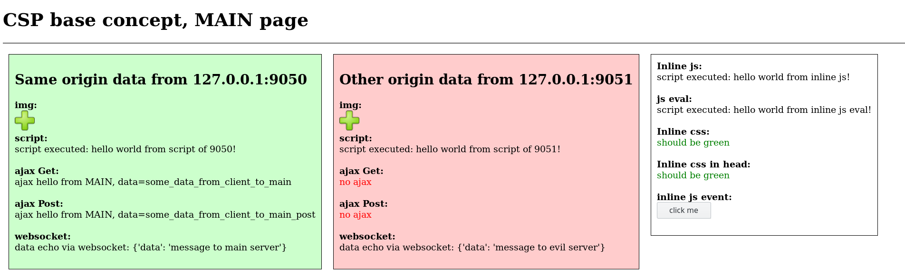
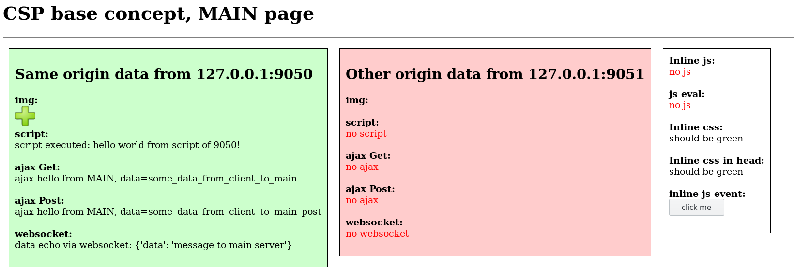

# Content security policy - CSP
Это про безопасность. Дополнительный механизм защиты браузера от фоновых походов по сети в неизвестные места. 

# Описание проблемы
Когда мы заходим на сайт, под капотом браузера происходит много интересного - чаще всего браузер связывается не только с сервером, обсуживающим этот сайт, но с множеством других серверов на других доменах для того, чтобы скачать / отправить дополнительную информацию - картинки, данные соцсетей, реклама, аналитика по сайту и много чего ещё.

Если зайти на какой-нибудь большой сайт, нажать F12 в Firefox / Chrome, перейти на вкладку Network и обновить страницу (F5) можно увидеть много всего интересного... и потенциально опасного. Потому что если злоумышленик внедрил свой javascript от имени "хорошего" сервера, он может взять и слить секретные данные с вашей страницы себе на сервер (XSS атака).

# Как работает CSP
* CSP - это заголовок HTTP, передаевый от сервера браузеру. Он говорит браузеру с какими местами в сети можно обмениваться информацией в фоновом режиме (AJAX-ы, подгрузки скриптов, картинок и проч.), а с какими нельзя.
* Таким образом,если есть заголовок CSP (при условии правильной настройки), даже в случае вндрения злого javascript на страницу, он не сможет слить данные куда попало, потому что браузер скажет "в заголовке CSP прописано что сюда нельзя ходить".
* При попытке похода в запрещённые места выведет в консоль (F12) предупреждение
* Есть возможность также настроить, чтобы браузер отправлял информацию о попытках нарушения CSP в указанный сервер разработчика (для отладки настроек CSP или ловли хакеров)

# Что показано в примере
* Запускаются два localhost http-сервера, работающих на разных портах. Один основной, другой "злой", с которым мы не хотим обмениваться данными 
* Основной сервер выдаёт браузеру страничку с примерами разных способов фоновых походов по сети
* Сначала видим что все походы в т.ч. в "злой" сервер работают
* Далее запускаем основной сервер с настройкой отдавать CSP и видим что походы на злой сервер теперь не работают

# Как запускать пример и как он работает
* Поставить зависимости
```
sudo pip3 install flask
sudo pip3 install flask-socketio
sudo pip3 install gevent gevent-websocket
```

* Запустить серверы
```
В одной консоли: cd .../principles/security/csp && ./server.py
В другой консоли: cd .../principles/security/csp && ./server.py --evil
```

* В браузере заходим на http://127.0.0.1:9050

* Видим, что почти всё работает: 
 

* Заметим что AJAX на сторонний сервер всё таки не работает. Это потому что same origin policy - дефалтовое ограничение в браузере (подробнее про это в другом месте)

* Посмотрим в консоли на серверы. Как в обычном, так и  в evil много всего, в частности есть такие строки:
```
2019-03-21 08:45:52,273 [INFO] [geventwebsocket.handler]: 127.0.0.1 - - [2019-03-21 08:45:52] "GET /test_evil.js HTTP/1.1" 304 196 0.002256
2019-03-21 08:45:52,284 [INFO] [geventwebsocket.handler]: 127.0.0.1 - - [2019-03-21 08:45:52] "GET /plus.png HTTP/1.1" 304 197 0.001299
2019-03-21 08:45:52,316 [INFO] [server EVIL]: >>>>>>>>>>>>>>>>>>> Got data from client by ajax: some_data_from_client_to_evil_post, method: POST
2019-03-21 08:45:52,318 [INFO] [server EVIL]: >>>>>>>>>>>>>>>>>>> Got data from client by ajax: some_data_from_client_to_evil, method: GET
2019-03-21 08:45:52,393 [INFO] [server EVIL]: >>>>>>>>>>>>>>>>>>> got data from websocket data={'data': 'message to evil server'}
```
Т.е. мы видим что данные сливаются в evil (в частности в неявном виде при GET запросе на картинку - ничто не мешает хакеру в GET запрос поставить ваши секретные данные)

* Теперь закроем страницу браузера (это важно сделать чтобы разорвать веб-сокетное соединение, иначе оно само будет переподниматься) и перезапустим серверы, основному поставив параметр `--csp`

* Видим такое:
 
Т.е. теперь всё связанное со сторонним сервером не работает. Также не работают inline js, css и события (попробуйте кликнуть на кнопку)

* Что наиболее важно - лог сервера evil теперь такой
```
2019-03-21 08:58:46,645 [INFO] [engineio.server]: Server initialized for gevent.
2019-03-21 08:58:46,781 [INFO] [werkzeug]:  * Restarting with stat
2019-03-21 08:58:47,071 [INFO] [engineio.server]: Server initialized for gevent.
2019-03-21 08:58:47,073 [WARNING] [werkzeug]:  * Debugger is active!
2019-03-21 08:58:47,074 [INFO] [werkzeug]:  * Debugger PIN: ...
```
И всё. Вообще никаких данных с клиента. Что и требовалось получить.

* В этом примере используется самый простой вариант CSP:
```
default-src 'self'
```
что означает "нельзя никуда и ничего кроме походов на свой сервер".

* Подробнее какие бывают правила и настройки CSP - go google
