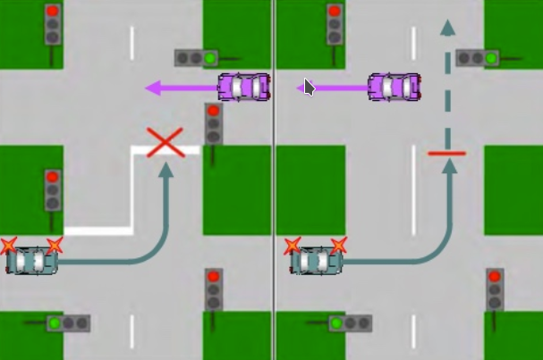

# Перекрёстки и приоритеты

## Что такое перекрёсток
Это любые пересечения проезжих частей на одном уровне, кроме:

* Выездов с прилегающих территорий
* Пересечений с эстакадами (т.е. не на одном уровне)

## Про пересечения проезжих частей
* На перекрёстке может быть >=1 пересечений проезжих частей. Т.е. если обе дороги состоят из 2 проезжих частей, то каждая с каждой - всего будет 4 пересечения.
* Общая площадь перекрёстка **больше**, чем площади пересечений проезжих частей
* Так вот те части перекрёстка, которые **не** являются пересечениями проезжих частей  - фактически есть продолжения дорог. Просто это очень маленькие кусочки дорог, **и на них важно не выезжать во встречный ряд** . Понимание этого очень важно для правильного проезда, например разворота.

## Типы перекрёстков
* Нерегулируемые
    * Равнозначные (без знаков) - по правилу правой руки, см ниже
    * Неравнозначные (главная vs второстепенная дорога)
* Регулируемые (светофор, регулировщик)
    * Приоритеты регулирования: регулировщик > светофор > знаки приоритета > правило правой руки
    * Если светофор миргает жёлтым - значит отключен, по приоритетам идём дальше

## Кто кому уступает на перекрёстке
Здесь похоже на сравнение элементов при сортировке. Сначала сравниваем по признаку A, если равны - далее по признаку B и т.д. Вот эти признаки в порядке убывания приоритета:

* Разрешающий сигнал светофора/регулировщика (кроме доп. секции, подробнее ниже)
* Главная или второстепенная дорога, если светофора нет (круг всегда главный, подробнее ниже)
* Трамваи имеют преимущество при прочих равных
* Правило правой руки - уступаем помехе справа

**Тонкости:**

* Если едем под доп. секцию светофора - мы на второстепенной дороге, уступаем всем
* Круговой перекрёсток - главная дорога

**Как определяется главная дорога:**

* Если есть светофор, то понятие не имеет смысла (за исключением случая с доп. секцией)
* По знакам
* Если нет знаков - главная будет с твёрдым покрытием
* Если обе с твёрдым - равнозначные дороги
* Все выезды с прилегающих территорий (и выезды трамваев из депо) - второстепенные

## Регулировщик
### Meta
По умолчанию ехать нельзя, кроме 3-х сигналов (по мере увеличения прав справа налево):

* Тычет палкой в тебя - можно только направо
* Руки в стороны (или опущены) и к тебе боком - можно направо или прямо (трамваи только прямо)
* Тычет палкой не в тебя, а к тебе боком, свободным от палки - можно в любом направлении (трамваи только налево)

### А также
* Регулировщик приоритетнее не только светофора, но и знаков предписаний и дорожной разметки предписаний.
* Т.е. да, путаница - светофор не отменяет знаки предписаний, а регулировщик отменяет
* Трамваи движутся "из руки в руку" регуляровщика - так проще запомнить

## Круговой перекрёсток
* Круговой перекрёсток - только если есть знак
* Круг по умолчанию главная дорога, если нет других знаков и светофоров
* На круге двигаться **только**  в направлении круга. Если надо разворот - проезжай весь круг

### Заезд на круг
* Заезд можно с любого ряда
* Заезд можно в любую полосу (но по здравому смыслу лучше правую, чтобы меньше полос пересекать в поперечном направлении)
* Включаем правый поворотник

### Выезд с круга
* Выезд с круга - это поворот направо, поэтому
    * Только с правой полосы круга
    * По возможности в крайнюю правую
* Иногда могут быть знаки "движение по полосам", разрешающие выезжать с круга из любой полосы
* Включаем правый поворотник

## Кто кому уступает в целом (например перестроение)
Если речь не о перекрёстке, то общий принцип - уступает тот, кто меняет траекторию движения:

* Начинаешь движение со стоянки - уступи
* Перестариваешься - уступи
    * Если оба перестраиваются - уступаем тому, кто справа
* Препятствие на полосе - уступи
    * Исключение - если едем на подъём (есть знак) и есть препятствие - тогда нам должны уступить

## Автомагистраль
* Это всегда главная дорога
* TODO тестировщик спрашивает: а есть перекрёстки автомагистралей?

## Пешеходы
* На пешеходном переходе и у перекрёстков уступать всегда и везде
* Не всегда есть зебра на пешеходом переходе. Но всегда есть знак
* **Нельзя останавливаться на пешеходном переходе!**
* TODO: а где ждать пешехода на перекрёстке - в центре или у выезда с него? Вопрос сложный
* Вне пешеходного перехода на прямой дороге:
    * В общем случае пешеход может переходить, если нет перехода в прямой видимости
    * Но вроде как он не имеет премущества
    * А вот как в реальности (в случае ДТП с пешеходом) - хз, лучше уступить на всякий случай
    * А если для этого придётся экстренно тормозить? TODO вопрос сложный
* Самые частые ДТП по статистике - столкновение с пешеходом

## Велосипедисты
* Велосипедистам уступаем всегда и везде
* TODO: а надо ли всегда уступать мопедам?
* Велосипеды и мопеды на проезжей части могут двигаться только по крайней правой, в крайнем правом положении
* Занимать не-правые даже для манёвров нельзя
* Обгонять велосипед и мопед можно даже если обгон запрещён

## Про свежий зелёный и свежий красный
* Если не удаётся уже безопасно затормозить при смене зелёного на жёлтый - надо ехать
* Даже двигаясь на зелёный водитель **обязан** уступить машинам, завершающим манёвр
* Если выехал на перекрёсток и тут же загорелся красный - уже обязан покинуть перекрёсток (если только он не составной, см. ниже)

## Составные перекрёстки

* Это перекрёстки, проезжая которые надо проехать **более одного** светофора
* Фактически это один перекрёсток, но по смыслу можно рассматривать как два
* Т.е. у каждой стоп линии возможно надо остановиться, если светфор красный

## Где останавливаться
* Если ПДД требуют остановиться (перекрёсток, жд переезд, знак "STOP" и т.д.), то надо понять где именно
* По мере уменьшения приоритета (если пункта нет, переходим к следующему):
    * Стоп-линия
    * Знак "СТОП" (не путать со "STOP")
    * У знака, запрещающего движение или светофора
    * Перед пересечением проезжей части (но не на пешеходном переходе)