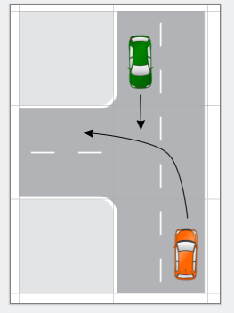
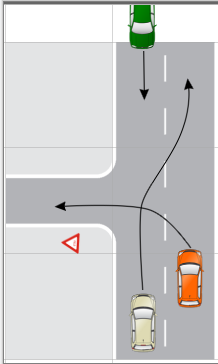
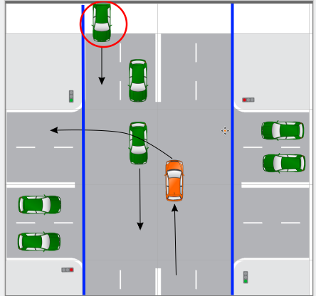
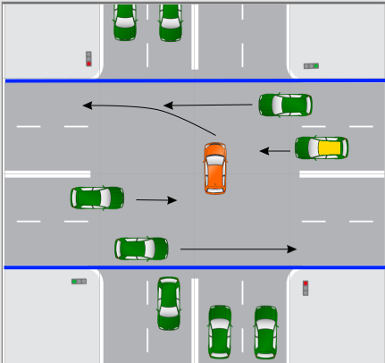
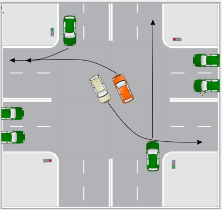
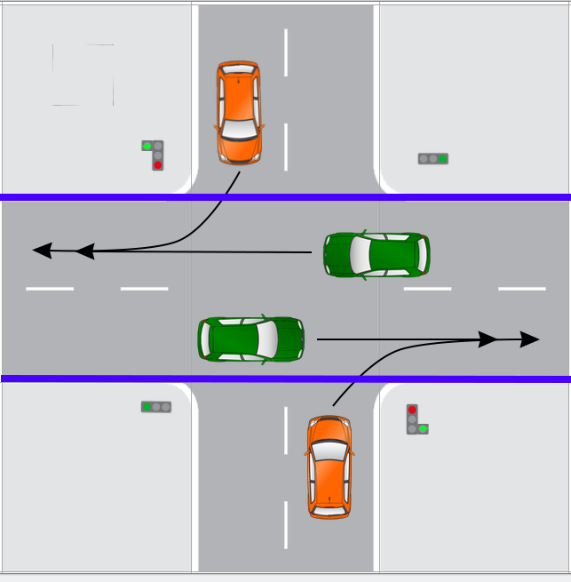
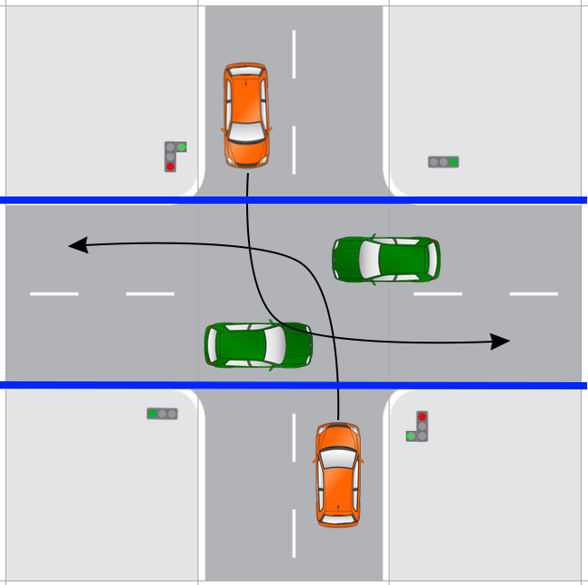
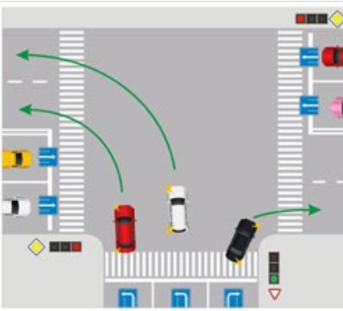

# Логика дороги

## Тривиальный поворот налево

* Мы меняем направление, а также у нас помеха справа
* **Поэтому пропускаем встречный поток**

### Учесть возможность обгоняющего при повороте налево

* **!!!ОЧЕНЬ ВАЖНО!!!** - на рисунке показано, почему надо **ВСЕГДА** смотреть назад при повроте, даже если в это одна встречная полоса. [Пример ДТП](https://www.youtube.com/watch?v=sZtoubjTL4I&t=273s)

## Поворот налево на перекрёстке со светофором
* По смыслу обычный перекрёсток можно воспринимать, как прямую дорогу, которая туда-сюда переключается
* Потому когда нам горит зелёный, смысл такой же как в тривиальном повороте налево - уступить встречке

* Стоит обратить внимание на машину, обведённую красным - **её изначально не видно!!!**
* Поэтому крайне важно перед манёвром видеть все ряды
* А ещё не выворачивать колёса на поворот, когда ждём (если нас стукнут в спину, есть риск вылететь на встречку)

### Eсли не успел покинуть перекрёсток на зелёный

* Поток, который надо пропускать слева, рано или поздно закончится, потому что светофор переключится
* В этом случае ситуация похожа на то, что мы въехали со двора с поворотом налево
* Если протупил и не успел проехать сразу при переключении светофора - **теперь придётся уступать тем, кто справа**, как на рисунке
* Как видно, мы уже создали затор для машины с жёлтой крышей, поэтому можно занять её полосу

### Взаимные повороты

* Зелёному, который хочет направо, уступаем как обычно
* C жёлтым лучше разъехаться **левыми** бортами:
    * Потому что у обоих тогда будет видимость справа
    * При одновременном выезде на перекрёсток траектории не пересекаются
    * Жёлтый также уступает зелёному снизу

## Синхронность и фазы светофоров
* Наиболее опасная фаза на светофорах - это когда одно направление заканчивает движение, а другое начинает
* Хорошо, когда есть переходная фаза, при которой **всем** запрещено двигаться (в этой фазе заканчивают манёвр те, кто уже на перекрёстке)
* В общем случае это не гарантируется, на всех перекрёстках светофоры запрограммированы по-разному
* В целом, часто бывает такая схема:
    * Одним зелёный поменялся на жёлтый, другим продолжает гореть красный
    * В этот момент все стоят
* А также может быть дополнительный регулируемый пешеходный переход:
    * Тогда может быть ещё одна фаза, когда всем машинам красный, а пешеходам зелёный

## Доп. секции светофора
* Это тюнинг перекрёстка для увеличения пропускной способсности и безопасности
* В целом алгоритмов может быть много, есть сложные перекрёстки, каждый со своими фазами и особенностями
* Они проектируются по разному, потому что везде разный профиль трафика уровень безопасности
* Рассмотрим несколько популярных случаев

### Увеличение пропускной способности поворота направо через правую стрелку

* Основная дорога по горизонтали (там зелёный)
* В случае обычного светофора вертикальные бы стояли
* Но тут есть фаза исключения - вертикальным машинам можно въезжать на основную дорогу направо как бы с второстепенной
* В данном случае может быть как полная фаза - зелёный + стрелка (тогда будет как обычно), так и доп. фаза - только стрелка
* Вот эта доп. фаза "только стрелка" увеличивает пропускную способность поворота направо - когда можно повернуть, чтобы попусту не стояли

### Увеличение безопасности и/или пропускной способности через левую стрелку

* Основная дорога по горизонтали (там зелёный)
* В случае обычного светофора вертикальные бы стояли
* Но тут есть фаза исключения - вертикальным машинам можно въезжать на основную дорогу налево как бы с второстепенной
* Это может быть отдельной фазой поврота - что поворот налево возможен **только** через стрелку, т.е. нет фазы "зелёный+стрелка"
    * Тогда будет исключена опасность получить в правый бок на скорости при повороте налево (как это бывает при обычном повроте)
    * Точнее можно получить от того кто тоже поворачивает, но скорость у него сильно меньше, т.к. ему нельзя прямо

## Многополосные повороты

* Тут понятно - для увеличения пропусной способности
* Если гарантируется, что с левой полосы нельзя прямо, тогда из второй слева тоже можно безопасно поворачивать, пересечений не будет
* Формально нет обязательств поворачивать каждый в свою полосу (можно любую), но по здравому смыслу - каждый в свою (иначе это будет перестроение прямо на перекрёстке)

## Круг
* TODO картинка и пару слов зачем он нужен
* TODO особенности того как заезжать и как выезжать

## Въезд на трассу
* TODO про трассы с полосой разгона и без

## Выезд с трассы
* TODO про трассы с полосой торможения и без

## Не надо рассчитывать только на ПДД
* TODO про то, что даже на главной смотреть по сторонам

## Дай дорогу дураку
* TODO сабж

## Турбо-перекрёсток
* TODO
