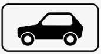
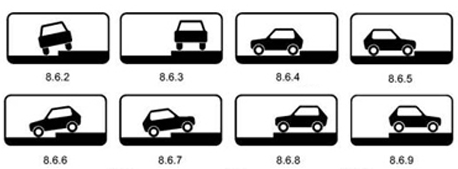
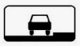
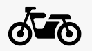
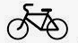

# Тонкости со знаками
# Области действия знаков
## Перекрёсточные
* Знаки приоритета, предписаний, запреты манёвров
* Отменяются:
    * При въезде выезде в/из НП
    * Если стоит на перекрёстке, то знак только про этот перекрёсток
    * Если перекрёсток имеет несколько пересечений проезжих частей, то знак **только для ближайшего пересечения**
    * Однако знаки особых предписаний (типа направление движения о полосам) - на весь перекрёсток)
    * Если знак стоит до перекрёстка, то **на ближайшем перекрёстке уже не действует**

## Ограничительные
* Всё что про ограничения, не связанные с перекрёстками и изменением направления движения
* Т.е. это про скорость, запреты остановки, обгонов и т.д.
* Отменяются:
    * При въезде выезде в/из НП
    * Если стоит явная отмена ограничения
    * Если у знака стояла табличка с длиной его действия
    * **На ближайшем перекрёстке**
    * Только для запрета остановки и стоянки: может быть специальная жёлтая полоса после знака, идущая по обочине, показывает сколько длится знак

## Зоны
* Обычные знаки с зоной действия как правило действуют только одного (текущего) направления движения и отменяются по правилам выше
* Но специальные знаки с текстом "ЗОНА" действуют для всех направлений движения, а также их не отменяют правила выше. Отменяются только знаками "конец зоны"

# Про таблички
* Просто цифра "300 м" - это расстояние до объекта, т.е. например запрет начнётся только через 300 м
* Цифра со стрелочками "↑300 м↑" - это продолжительность действия знака, она никак не влияет на то, где начнёт действовать знак, т.е.:
    * если это запрет, то **он начинается прямо сейчас!**
    * если это предупреждающий знак, то как обычно - через 50-100 м в НП например
* Есть особые уточняющие таблички про запрет стоянки и остановки. Из наиболее важного:
    * "↓" в корне меняет смысл - это конец запрета
    * "↕" говорит что тут действие запрета продолжается, т.е. запрет актуален и до и после знака
* Направление действия запретов - можно например поставить запрет, но только в направлении направо

# Таблички с видом ТС
* Тут адовая путаница с изображением легковой машины на табличках.
* [Хорошее видео по теме](https://www.youtube.com/watch?v=mdm26y1li_8).
* Есть три основных группы знаков с легковой машиной

## 1. Обычная табличка

* **Входят**: Легковые + грузовики 3.5т
* **Не входят**: все остальные - мотоциклы, большие грузовики, автобусы, трактора и т.д.
* Устанавливается со знаками про движение

## 2. Парковочные таблички

* **Входят**: Легковые + мотоциклы
* **Не входят**: все остальные - **любые** грузовики (даже пикапы на основе легковых), мопеды, трактора и проч.
* Устанавливается со знаками про парковку

## 3. Дефалтовая парковка (8.6.1)

* **Входят**: Все без исключения, даже лошади
* Устанавливается со знаками про парковку

## 4. Остальное
* Знак дорога для автомобилей - это для всех, кто умеет болкк 40 км/с (мопеды - не умеют!)
* Движение механических ТС запрещено (машина в красном круге) - это про всех, кто имеет двигатель, включая мопеды

# Таблички про мотоциклы и мопеды
## Вот это мотокиклы

## А это - мопеды и велосипеды (да, они вместе)

# Тонкости про запрет стоянки
* Есть знаки запрета стоянки по чётным (II) и нечётным (I) дням
* Однако день тут начинается в 21:00 - на 3 часа раньше! (UTC?)
* А с 19 до 21 запреты не действуют - чтобы переставить машину

# Про временные знаки
* Временные знаки - на жёлтом фоне. Они в приоритете