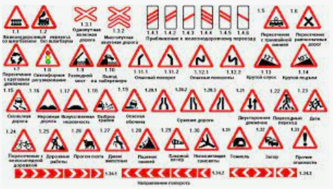
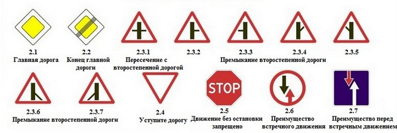
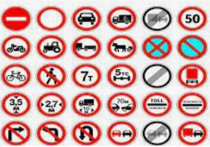
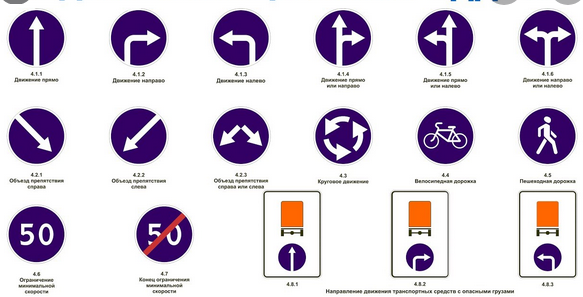
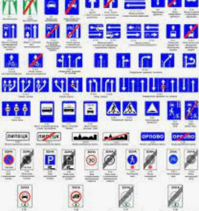
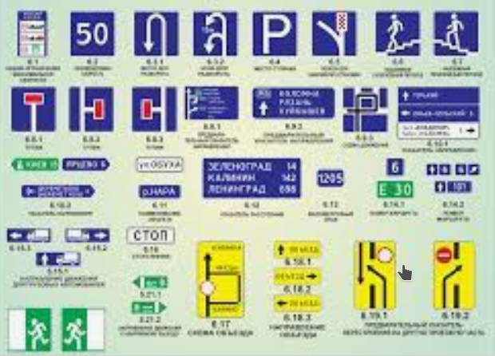
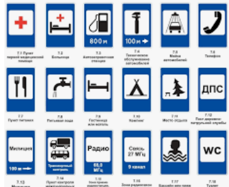
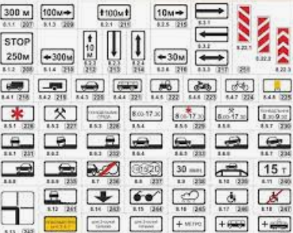

# Типы дорожных знаков

# Предупреждающие

* Обязательства не накладывают
* В НП ставятся за 50-10 метров
* Вне НП ставятся за 150-300 метров

# Знаки приоритета

* **Накладывают обязательства** - определяют кто кому уступает дорогу
* Ставятся прямо на месте обязательства
* Отменяются светофорами
* Заканчиваются на ближайшем перекрёстке или при въезде/выезде из НП

# Запрещающие

* **Накладывают обязательства** - запрещают что-то
* Ставятся прямо на месте начала запрета (если иное не указано на доп. табличке, см ниже)

# Предписывающие

* **Накладывают обязательства** - делать можно только то, что на знаках
* Ставятся прямо на месте начала предписания

# Особых предписаний

* **Накладывают обязательства** - вводят определённый пресет правил только для этого участка дороги
* Ставятся прямо на месте изменения режима движения

# Информационные

* Сообщить что-то об особенностях движения
* **Некторые накладывают обязательства** (см. про разворот)

# Сервиса

* Сообщить что-то о разных полезняшках, не связанных напрямую с движением

# Дополнительной информации (таблички)

* Уточнение информации других знаков

